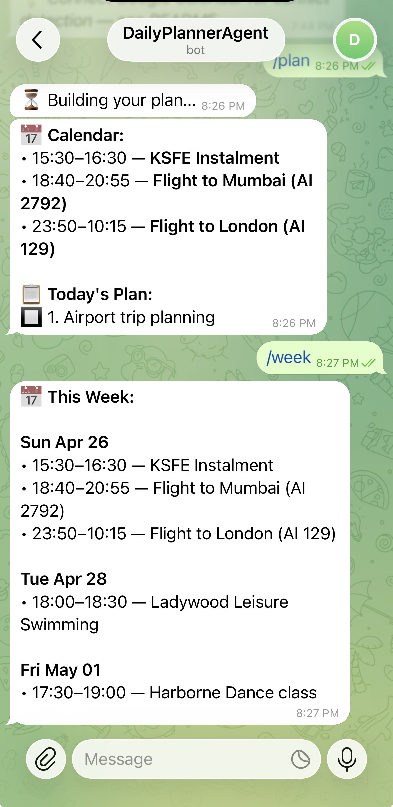

# Personal Daily Planner — Telegram Bot

A Telegram bot powered by Google Gemini AI (free tier) that generates prioritized daily task lists, integrates with Google Calendar, and sends scheduled morning/evening briefings.

---

## Features

- **AI-generated task plans** — Gemini analyzes your calendar events and creates a prioritized task list each morning
- **Google Calendar integration** — fetches today's and this week's events; flags tasks that may conflict with meetings
- **Morning & evening briefings** — automated messages at configurable times via APScheduler
- **Task management** — add, complete, and skip tasks via Telegram commands
- **End-of-day summaries** — Gemini writes a short reflection on what you accomplished
- **Persistent storage** — tasks and settings survive restarts (SQLite)
- **Single-user security** — the bot only responds to the registered chat ID

---

## Prerequisites

| Requirement | Notes |
|---|---|
| Python 3.11+ | Earlier versions untested |
| Telegram account | [telegram.org](https://telegram.org) |
| Google Gemini API key | Free at [aistudio.google.com/app/apikey](https://aistudio.google.com/app/apikey) |
| Google Cloud account | Only needed for calendar integration |

---

## Local Setup (macOS)

### 1. Install Python via Homebrew

If you don't have Homebrew installed:

```bash
/bin/bash -c "$(curl -fsSL https://raw.githubusercontent.com/Homebrew/install/HEAD/install.sh)"
```

Then install Python:

```bash
brew install python@3.11
```

Verify:

```bash
python3.11 --version
```

### 2. Clone the repo and create a virtual environment

```bash
git clone <your-repo-url>
cd personal-daily-plan-agent
python3.11 -m venv .venv
source .venv/bin/activate
pip install -r requirements.txt
```

You'll need to run `source .venv/bin/activate` each time you open a new terminal session. Or use the full path: `.venv/bin/python main.py`.

### 3. Create a Telegram bot

1. Open Telegram and search for **@BotFather**
2. Send `/newbot` and follow the prompts
3. Copy the token (looks like `123456:ABC-DEF1234...`)

### 4. Configure environment variables

```bash
cp .env.example .env
open -e .env        # opens in TextEdit; or use: nano .env
```

Fill in your values:

```env
TELEGRAM_BOT_TOKEN=123456:ABC-DEF1234ghIkl-zyx57W2v1u123ew11
TELEGRAM_CHAT_ID=          # leave blank — set automatically on first /start
GEMINI_API_KEY=AIza...
```

### 5. Run the bot

```bash
source .venv/bin/activate
python main.py
```

### 6. Send `/start` to your bot in Telegram

The bot will register your chat ID and display the available commands.

### 7. Generate your first plan

Send `/plan` to generate today's task list.

---

## Running in the Background on Mac

To keep the bot running after you close the terminal, use **launchd** — macOS's built-in service manager.

### Step 1 — Create the plist file

Create `~/Library/LaunchAgents/com.dailyplanner.bot.plist`:

```xml
<?xml version="1.0" encoding="UTF-8"?>
<!DOCTYPE plist PUBLIC "-//Apple//DTD PLIST 1.0//EN"
  "http://www.apple.com/DTDs/PropertyList-1.0.dtd">
<plist version="1.0">
<dict>
  <key>Label</key>
  <string>com.dailyplanner.bot</string>

  <key>ProgramArguments</key>
  <array>
    <string>/path/to/personal-daily-plan-agent/.venv/bin/python</string>
    <string>/path/to/personal-daily-plan-agent/main.py</string>
  </array>

  <key>WorkingDirectory</key>
  <string>/path/to/personal-daily-plan-agent</string>

  <key>EnvironmentVariables</key>
  <dict>
    <key>TELEGRAM_BOT_TOKEN</key>    <string>YOUR_TOKEN_HERE</string>
    <key>GEMINI_API_KEY</key>        <string>YOUR_KEY_HERE</string>
  </dict>

  <key>StandardOutPath</key>
  <string>/path/to/personal-daily-plan-agent/bot.log</string>
  <key>StandardErrorPath</key>
  <string>/path/to/personal-daily-plan-agent/bot.err</string>

  <key>RunAtLoad</key>
  <true/>
  <key>KeepAlive</key>
  <true/>
</dict>
</plist>
```

Replace `/path/to/personal-daily-plan-agent` with the actual path (run `pwd` inside the project folder to get it).

### Step 2 — Load and start

```bash
launchctl load ~/Library/LaunchAgents/com.dailyplanner.bot.plist
launchctl start com.dailyplanner.bot
```

### Step 3 — Check status and logs

```bash
launchctl list | grep dailyplanner     # should show PID if running
tail -f /path/to/personal-daily-plan-agent/bot.log
```

### Stop / restart

```bash
launchctl stop com.dailyplanner.bot
launchctl unload ~/Library/LaunchAgents/com.dailyplanner.bot.plist   # remove from autostart
```

> The bot starts automatically at login and restarts if it crashes (`KeepAlive: true`).

---

## Google Calendar Integration

This step is optional. Without it, the bot works fully — it just won't fetch calendar events.

### Step 1 — Create a Google Cloud project

1. Go to [console.cloud.google.com](https://console.cloud.google.com)
2. Click **Select a project** → **New Project**
3. Give it a name (e.g., `daily-planner`) and click **Create**

### Step 2 — Enable the Google Calendar API

1. In your project, go to **APIs & Services → Library**
2. Search for **Google Calendar API**
3. Click it and press **Enable**

### Step 3 — Create OAuth 2.0 credentials

1. Go to **APIs & Services → Credentials**
2. Click **Create Credentials → OAuth client ID**
3. If prompted, configure the OAuth consent screen first:
   - User type: **External**
   - Fill in app name and your email; save
   - Under **Scopes**, add `https://www.googleapis.com/auth/calendar.readonly`
   - Add your Google account email under **Test users**
4. Back in Credentials, create the OAuth client:
   - Application type: **Desktop App**
   - Name it anything (e.g., `DailyPlannerBot`)
5. Click **Download JSON** — save this file as `credentials.json` in the project root

### Step 4 — Authorize the bot

Run the one-time setup script **on a machine with a browser** (your laptop, not a headless server):

```bash
python setup_calendar.py
```

This opens a browser window asking you to sign in with Google and grant read-only calendar access. After approval, a `token.json` file is created in the project root. The bot uses this file automatically — no repeated logins needed (the token auto-refreshes).

### Step 5 — Verify

Restart the bot and send `/week`. You should see your upcoming calendar events.

> **Running on a headless server?** Run `setup_calendar.py` locally first, then copy `token.json` to the server alongside the bot.

---

## Commands Reference

| Command | Description |
|---|---|
| `/start` | Register your chat ID and display the command list |
| `/plan` | Generate (or display) today's prioritized task list |
| `/plan --refresh` | Force Gemini to regenerate the task list |
| `/add [description]` | Add a new task for today |
| `/done [#]` | Mark task number `#` as complete ✅ |
| `/skip [#]` | Mark task number `#` as skipped ⏩ |
| `/review` | Generate an end-of-day summary with Gemini |
| `/week` | Show this week's Google Calendar events |
| `/settime [morning\|evening] [HH:MM]` | Change the briefing time |
| `/timezone [tz]` | Set your timezone (e.g. `America/New_York`) |

### Examples

```
/add Submit expense report
/done 3
/skip 7
/settime morning 07:30
/timezone Europe/London
```

---

## Scheduled Briefings

The bot sends two automatic messages each day:

| Briefing | Default time | Contents |
|---|---|---|
| Morning | 08:00 | Calendar events + AI-generated task plan |
| Evening | 20:00 | Task status summary + Gemini's end-of-day reflection |

Change the times at any time with `/settime`:

```
/settime morning 07:00
/settime evening 21:30
```

Times are stored in the database and survive restarts. The scheduler reloads immediately — no restart needed.

---

## Configuration

### Environment variables

| Variable | Required | Description |
|---|---|---|
| `TELEGRAM_BOT_TOKEN` | Yes | Token from BotFather |
| `GEMINI_API_KEY` | Yes | Google Gemini API key (free) |
| `TELEGRAM_CHAT_ID` | No | Pre-register your chat ID (otherwise set via `/start`) |
| `GOOGLE_CREDENTIALS_FILE` | No | Path to OAuth credentials JSON (default: `credentials.json`) |

### Bot settings (stored in SQLite)

| Setting | Default | Changed via |
|---|---|---|
| `chat_id` | — | `/start` |
| `timezone` | `UTC` | `/timezone` |
| `morning_time` | `08:00` | `/settime morning` |
| `evening_time` | `20:00` | `/settime evening` |

### Timezone names

Use IANA timezone database names. Common examples:

| Region | Timezone |
|---|---|
| US Eastern | `America/New_York` |
| US Pacific | `America/Los_Angeles` |
| UK | `Europe/London` |
| Central Europe | `Europe/Berlin` |
| India | `Asia/Kolkata` |
| Japan | `Asia/Tokyo` |
| Australia (Sydney) | `Australia/Sydney` |

Full list: [en.wikipedia.org/wiki/List_of_tz_database_time_zones](https://en.wikipedia.org/wiki/List_of_tz_database_time_zones)

---

## Project Structure

```
personal-daily-plan-agent/
├── main.py                 # Entry point — starts the bot
├── setup_calendar.py       # One-time Google OAuth setup
├── requirements.txt
├── .env                    # Your secrets (not committed)
├── .env.example            # Template
├── credentials.json        # Google OAuth client credentials (not committed)
├── token.json              # Google OAuth token, auto-created (not committed)
├── planner.db              # SQLite database, auto-created
└── src/
    ├── __init__.py
    ├── bot.py              # Telegram command handlers
    ├── calendar_client.py  # Google Calendar API client
    ├── planner.py          # Gemini AI integration
    ├── scheduler.py        # APScheduler morning/evening jobs
    └── storage.py          # SQLite persistence layer
```

---

## Free Hosting Options

If you want the bot to run 24/7 without leaving your Mac on, here are genuinely free cloud options ranked by ease of setup.

---

### Option 1 — Oracle Cloud Always Free (Recommended)

Oracle's Always Free tier gives you a real Linux VM with no time limit or credit card expiry requirement. It's the most generous free cloud tier available.

**What you get:** 2 AMD VMs (1 OCPU, 1 GB RAM each) or up to 4 ARM VMs — free forever.

**Setup:**

1. Sign up at [cloud.oracle.com](https://cloud.oracle.com) — requires a credit card for identity verification but is never charged on Always Free resources
2. Create a VM instance: **Compute → Instances → Create Instance**
   - Shape: `VM.Standard.E2.1.Micro` (Always Free)
   - Image: Oracle Linux or Ubuntu
   - Download the SSH key pair
3. SSH into the VM and set up the bot:

```bash
ssh -i your-key.pem ubuntu@YOUR_VM_IP

# On the VM:
sudo apt update && sudo apt install -y python3.11 python3.11-venv git
git clone <your-repo-url>
cd personal-daily-plan-agent
python3.11 -m venv .venv
source .venv/bin/activate
pip install -r requirements.txt
cp .env.example .env
nano .env    # fill in your keys
```

4. Run as a systemd service:

```bash
sudo nano /etc/systemd/system/daily-planner.service
```

```ini
[Unit]
Description=Personal Daily Planner Telegram Bot
After=network.target

[Service]
Type=simple
User=ubuntu
WorkingDirectory=/home/ubuntu/personal-daily-plan-agent
ExecStart=/home/ubuntu/personal-daily-plan-agent/.venv/bin/python main.py
Restart=always
RestartSec=10
EnvironmentFile=/home/ubuntu/personal-daily-plan-agent/.env

[Install]
WantedBy=multi-user.target
```

```bash
sudo systemctl daemon-reload
sudo systemctl enable daily-planner
sudo systemctl start daily-planner
journalctl -u daily-planner -f    # view logs
```

---

### Option 2 — Fly.io Free Tier

Fly.io gives you 3 small VMs (256 MB RAM) free per month — enough for a lightweight bot.

**Setup:**

1. Install the Fly CLI on Mac:
```bash
brew install flyctl
flyctl auth signup
```

2. Add a `Dockerfile` to the project root:

```dockerfile
FROM python:3.11-slim
WORKDIR /app
COPY requirements.txt .
RUN pip install --no-cache-dir -r requirements.txt
COPY . .
CMD ["python", "main.py"]
```

3. Deploy:

```bash
flyctl launch          # creates fly.toml, choose free shared-cpu-1x
flyctl secrets set TELEGRAM_BOT_TOKEN=... GEMINI_API_KEY=...
flyctl deploy
```

4. View logs:
```bash
flyctl logs
```

> **SQLite note:** Fly's free VMs don't have persistent disk by default. Your database resets on redeploy. To persist it, add a Fly Volume (`flyctl volumes create`) or use the bot for a week before worrying about this — tasks are daily and naturally expire.

---

### Option 3 — PythonAnywhere Free Tier

PythonAnywhere lets you run one always-on background task for free — ideal for a Telegram polling bot.

1. Sign up at [pythonanywhere.com](https://www.pythonanywhere.com)
2. Open a **Bash console** and clone the repo:

```bash
git clone <your-repo-url>
cd personal-daily-plan-agent
python3.11 -m venv .venv
source .venv/bin/activate
pip install -r requirements.txt
cp .env.example .env
nano .env
```

3. Go to **Tasks** tab → **Always-on tasks** → add:

```
/home/YOUR_USERNAME/personal-daily-plan-agent/.venv/bin/python /home/YOUR_USERNAME/personal-daily-plan-agent/main.py
```

4. Click **Create**. The bot runs continuously and restarts if it crashes.

> **Limitation:** Free accounts have a CPU usage quota per day. For a personal planner with 2 scheduled messages and occasional commands, you'll stay well within it.

---

### Comparison

| Option | Free forever | RAM | Persistent storage | Setup difficulty |
|---|---|---|---|---|
| Oracle Cloud | Yes | 1 GB | Yes | Medium |
| Fly.io | Yes (3 VMs) | 256 MB | Needs volume | Easy |
| PythonAnywhere | Yes (1 task) | Shared | Yes | Easiest |

---

## Security Notes

- **Single-user bot** — the bot only responds to the chat ID registered via `/start`. Anyone else who messages the bot receives no response.
- **Keep `.env` private** — never commit it to version control. The `.gitignore` should exclude it.
- **Keep `credentials.json` and `token.json` private** — these grant read access to your Google Calendar.
- **Principle of least privilege** — the Google Calendar scope is `calendar.readonly`; the bot cannot modify your calendar.
- **Gemini API key** — treat it like a password. Rotate it immediately if exposed.

---

## Troubleshooting

### Bot doesn't respond

- Check that `TELEGRAM_BOT_TOKEN` is correct
- Ensure the bot is running (`python main.py` shows no errors)
- Make sure you sent `/start` first so your chat ID is registered
- Confirm you're messaging the right bot username

### "TELEGRAM_BOT_TOKEN is not set"

Your `.env` file is missing or not being loaded. Ensure `.env` exists in the project root and contains the token.

### Google Calendar not working

- Confirm `credentials.json` is in the project root
- Run `python setup_calendar.py` — if it says the token is valid, the issue is elsewhere
- Check that the Google Calendar API is enabled in your Cloud project
- Ensure your Google account is listed as a test user on the OAuth consent screen
- Delete `token.json` and re-run `setup_calendar.py` to force re-authorization

### Scheduled briefings not arriving

- Verify your timezone is set correctly: `/timezone` shows the current value
- Check that the bot process is still running
- Confirm morning/evening times with `/settime` (no arguments shows current values)
- Check the bot logs for APScheduler errors

### "No tasks generated" in morning briefing

- Send `/plan` manually to test plan generation
- Check that `GEMINI_API_KEY` is valid and not expired
- Look for error messages in the bot logs (`logging.ERROR` entries)

### Tasks duplicated after `/plan`

- Use `/plan --refresh` only when you want to regenerate; plain `/plan` reuses existing tasks

### Telegram Bot

---

## AI Model

This bot uses **Google Gemini 2.0 Flash** (`gemini-2.0-flash`) — a free model via Google AI Studio — for:

- Generating prioritized daily task lists from your calendar events and goals
- Writing end-of-day summaries that reflect on completed, skipped, and pending tasks

Get your free API key at [aistudio.google.com/app/apikey](https://aistudio.google.com/app/apikey). The free tier allows up to 15 requests per minute and 1 million tokens per day — more than enough for a personal planner.

---

## License

MIT — do whatever you want with this.
